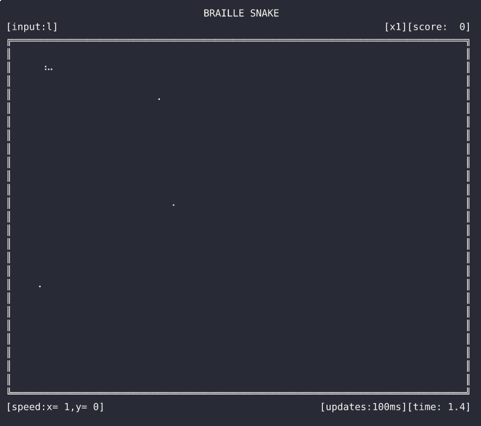
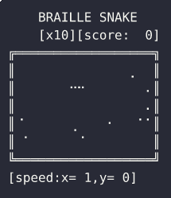
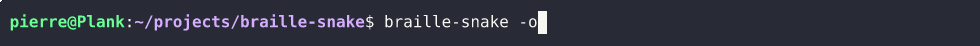
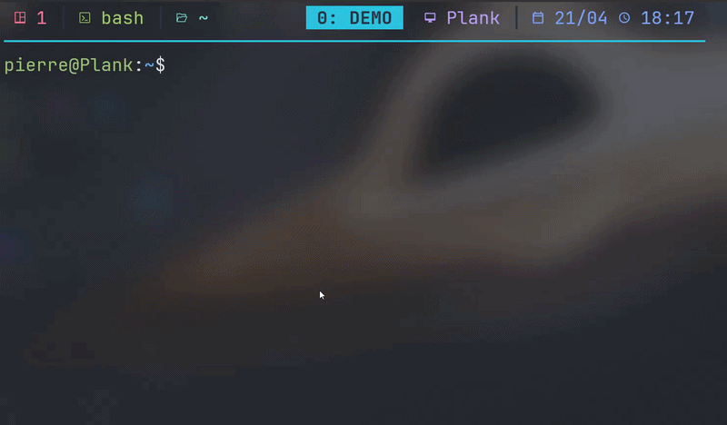
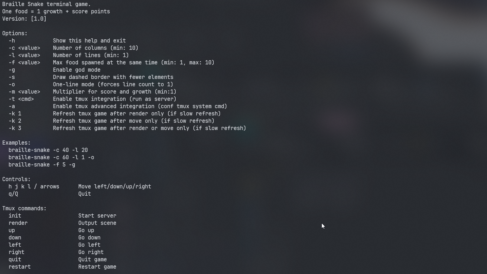

# Intro

This project is inspired by [URL Snake](https://urlsnake.com/).

## Demos

### Standalone

#### Gameplay


#### Options


#### One Line Mode


### Tmux Integration

#### Within tmux


### Features

#### Help


## Help

The build system for this project is CMake.
Setup build folders:
```bash
cmake -B build

Build project (same as 'make' when using Makefiles):
```
```bash
cmake --build build
```

Build debug (with adress sanitizer)
```bash
cmake -S . -B build-debug \
  -DCMAKE_BUILD_TYPE=Debug \
  -DCMAKE_C_FLAGS="-fsanitize=address -fno-omit-frame-pointer -g" \
  -DCMAKE_EXE_LINKER_FLAGS="-fsanitize=address"
cmake --build build-debug
```

## Tmux Install

To install with tmux you need the binary in /bin, use cmake for that:

```bash
cmake --install build --prefix ~/.local
```

Then configure tmux like in the example (tmux-setup/).

### regular
Uses tmux built-in refresh rate to update the game.
This is very slow (1sec refresh rate max).
Huge lag between user input and rendering game.
No environment constraints.

### optimized
Game server update a display variable every tick.
No tmux built-in refresh.
Very fast, low input lag, high refresh rate.
Server send a lot of tmux config commands in the shell (background).
Need server permission to use system call.

### hybrid
Every tmux input update the rendering display.
No tmux built-in refresh.
Very fast when user input something.
Doesn't refresh otherwise.
No environment constraints but require gameplay to be easier (no auto move / inertia).

## TODO List
- [x] Create Grid visible in braille
- [x] Add score display
- [x] Add player control
- [x] Add player cell management
- [x] Add goal spawn
- [x] Add collision detection (good and bad)
- [x] Add win condition and defeat
- [x] Add nice border and adapt for one line mode
- [x] Add confirm input to quit/restart
- [x] Adapt layout to game size (define a layout size)
- [x] Add time display
- [x] Add double buffer (mostly for muti-line games)
- [x] Add options to change game settings
- [x] Dont show texts if too small size (one line too)
- [x] Add speed variation with score and multiplier
- [x] Mode for tmux integration

Copyright (c) 2026 Pierre Mollard. All Rights Reserved.
